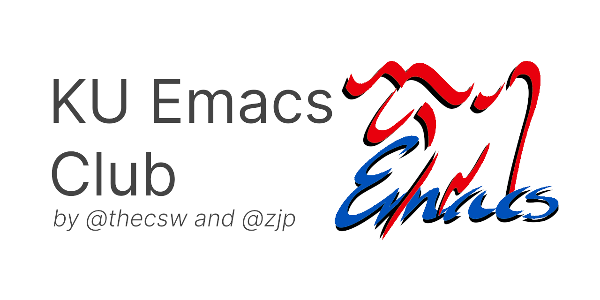

html-scripts:t html-style:t html5-fancy:t tex:t toc:nil num:nil

html-link-use-abs-url:nil html-postamble:auto html-preamble:t

html-postamble:nil

Announcement regarding COVID-19
===============================

Due to the recent developments around the ongoing COVID-19 pandemic, KU
Emacs Club is suspending all its operations and cancelling all future
meetings/talks throughout the end of the semester. Please visit [KU\'s
webpage](https://coronavirus.ku.edu/) to get latest updates. Stay safe

Sandy and Zach

Our mission
===========

``` {.commonlisp org-language="lisp"}
(defun mission-statement ()
  "Print the KU Emacs Club mission statement."
  (interactive)
  (message "Emacs Club is an eclectic gathering of hackers in the spirit of our
forebearers' homebrew computer clubs; a place to demystify the tools available
to computer scientists, share insights and exchange ideas, and create one's own
master tool to dissolve the barrier between thought and code"))
(provide 'emacs-club)
```

Schedule
========

  Date         Place          Time     Topic                                 Host
  ------------ -------------- -------- ------------------------------------- --------------------------
  29 October   1144 ISB       6:00pm   Coreboot                              Sebastian McMillan
  22 October   1144 ISB       6:00pm   Functional Web Programming with Elm   Alex Shadley
  8 October    1144 ISB       6:00pm   The Go Programming Language           Sandy Uraz (VP)
  1 October    201 Anschutz   6:00pm   Intro to Emacs Club                   Zach Pearson (President)

Current Officers
================

-   Zach Pearson, Co-Founder and President (<zjp@ku.edu>)
-   Sagindyk (Sandy) Urazayev, Co-founder and Vice-President
    (<ctu@ku.edu>)
-   Jonathan Downs, Treasurer

Resources
=========

[Meeting Notes](https://github.com/KUEmacs/meeting-notes)

M-x describe-this-webpage
=========================

This webpage is written in pure Emacs Org-Mode. The webpage code is
[here](https://github.com/kuemacs/kuemacs.github.io).
